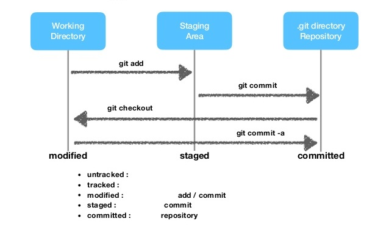
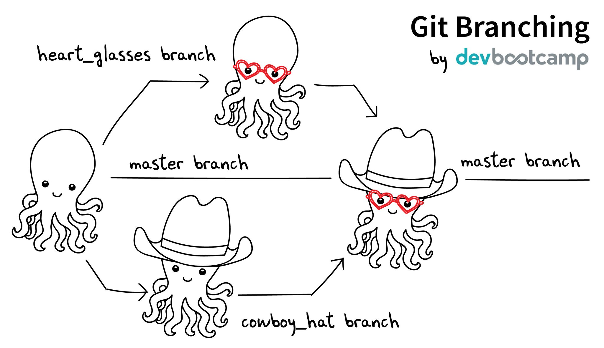

# 1. 깃 소개

***

# Git

동일한 파일에 대한 여러 버전을 관리하는 `분산 버전관리 시스템(Distributed Version Control System)`입니다. 원격 저장소와 참여하는 모든 개발자가 개별적으로 갖고 있는 로컬 저장소로 구성됩니다. 2005년 탄생했으며 리눅스 커널 개발자인 리누스 토르발즈가 기존 버전관리 프로그램들의 상용화에 반대하여 2주만에 만든 것으로 유명합니다.

* 공유물을 원격저장소와 협업자의 컴퓨터의 각각 저장하여 자료의 손실을 막아주는 도구
* 개발자들의 협업을 지원하는 도구
* 변화 이력을 추적할 수 있는 도구
* 창작물을 원하는 시점으로 되돌릴 수 있는 도구

깃에서의 논리적 단위는 커밋(Commit)으로 `커밋은 독립적인 변화의 묶음을 영속화한 것`입니다. 또한 커밋은 단순히 커밋한 코드뿐만 아니라 관련된 메타 데이터도 포함합니다. 변화가 일어날 때마다 이전 커밋과의 변경점을 추적합니다. 커밋이 되면 해당 데이터는 정적인 상태로써 지울수는 있어도 절대로 변경할 수는 없습니다.

## 작동방식

깃의 데이터는 파일들의 Snapshot(그 순간의 상태의 기록물)입니다. 깃은 파일을 저장하거나 커밋하는 시점에서 변화를 감지합니다. 깃은 전체 소스를 대상으로 스냅샷을 남기지 않습니다. 파일이 달라지지 않았다면 깃은 성능을 위해서 파일을 저장하지 않고 링크만 저장합니다.

## 체크섬(커밋해쉬값)

깃은 커밋 명령으로 백업할 때 마다 유니크한 체크섬 값을 붙여서 데이터를 관리합니다. 체크섬은 원자적인 데이터 단위입니다. 깃은 SHA-1 해시를 사용하여 체크섬을 만듭니다. 체크섬은 40자 길이의 16진수 문자열입니다.

예: `24b9da6552252987aa493b52f8696cd6d3b00373`

***

# 세 개의 영역

### Working Directory

프로젝트 파일들이 있는 디렉토리입니다. 물리적으로 프로젝트 폴더에서 .git 폴더를 제외한 파일 및 폴더를 의미합니다. 눈에 보이기 때문에 사용자가 편집하기 수월합니다. 워킹 디렉토리의 모든 파일은 `Tracked`와 `Untracked`상태로 구분됩니다. `Tracked` 파일은 깃의 관리대상으로써 `Unmodified`,` Modified`, `Staged` 상태 중 하나의 상태를 갖습니다. Tracked 파일이 아닌 모든 파일은 Untracked 상태입니다. 

### Staging Area(Index)

.git/index 파일입니다. 하나의 큰 바이너리 파일이고 곧 커밋할 파일에 대한 정보(파일 정보, SHA1 체크섬, 타임 스탬프)를 저장합니다. 커밋 대상들이 존재하는 공간입니다. Index 영역이라고 부르기도 합니다. 

Index는 바로 다음에 커밋할 대상입니다. 이런 개념을 `Staging Area` 라고 부릅니다. `Staging Area`는 사용자가 `git commit` 명령을 실행했을 때 깃이 처리할 것들이 있는 곳입니다.

### Git Repository

.git/objects 폴더안에 존재합니다. 깃이 프로젝트의 메타데이터와 객체 데이터베이스를 저장하는 곳을 가리킵니다. 커밋된 내역들이 존재하는 공간입니다. 

커밋을 보관하는 저장소는 압축된 BLOB 파일입니다. 저장소에 커밋은 압축된 한 덩어리로써 파일별로 구분할 수 없는 상태이므로 파일별 개별적인 복원은 지원하지 않습니다.

* Local Repository(로컬 저장소)
내 PC에 존재하는 개인 용 로컬 저장소입니다.

* Remote Repository(원격 저장소)
전용 서버에서 관리되며 여러 사람이 공유하는 자원을 위한 원격 저장소입니다. 관습적으로 `origin` 이라는 별칭으로 부릅니다.

## 특수 목적 포인터

### HEAD

깃은 HEAD라는 특수한 포인터를 갖고 있습니다. 이 포인터는 현재 작업하고 있는 브랜치 또는 커밋을 가리키는 용도로 사용합니다. 

HEAD는 현재 브랜치를 가리키는 포인터이며 브랜치는 브랜치에 담긴 커밋 중 가장 마지막 커밋을 가리키는 포인터입니다. 지금의 HEAD가 가리키는 커밋은 바로 다음 커밋의 부모가 됩니다.

`HEAD --> master --> 커밋해쉬값(체크섬)`

HEAD 포인터가 master 브랜치를 가리킵니다. master 브랜치 포인터가 유니크한 커밋해쉬값으로 특정 백업상태를 가리킵니다. 일반적으로 브랜치 포인터는 해당 브랜치의 최신 커밋을 가리키는 상태에서 사용합니다만 최근 몇 개의 커밋을 버리기 위해서 그렇지 않도록 조작할 수 있습니다.

`HEAD --> 커밋해쉬값(체크섬)`

HEAD 포인터가 특정 브랜치 포인터를 거쳐서 어떤 커밋을 지칭하는 것이 아니라 직접 특정 커밋을 가리키는 상태입니다. 이 상태를 `분리된 HEAD 모드` 상태라고 부릅니다. 주로 지난 커밋 중 하나로부터 새로운 브랜치를 만들고자 할 때 사용되는 방식입니다. 대부분의 경우 HEAD 포인터는 특정 브랜치를 지칭한 상태로 작업하게 됩니다.

### ORIG_HEAD

HEAD가 이전에 가리키던 커밋을 참조합니다. 커밋의 구성을 조작(rebase)할 때 이전 상태로 되돌리기 위한 참조용도로 사용합니다.

***

# Branch(브랜치)

브랜치는 작업을 분리하여 무언가를 만들 때 사용합니다. 여러분이 저장소를 새로 만들면 기본적으로 master 브랜치가 만들어집니다. 다른 브랜치를 이용해서 개발을 진행하고 개발이 완료되면 master 브랜치에 병합해서 적용할 수 있습니다.

별도의 작업공간을 생성하여 작업하다가 마음이 바뀌면 이전 작업공간으로 휙~ 돌아갈 수 있다면 얼마나 멋질까요? 별도의 작업공간을 위해서 깃은 브랜치를 사용합니다. 별도의 작업공간을 위해서 매번 새로 폴더를 만드는 것이 아닙니다. 브랜치는 사실 특정 커밋(상태가 확정된 백업 본)을 가리키는 포인터입니다. 특정 브랜치로 체크아웃하게 되면 해당 커밍의 내역을 워킹 디렉토리로 복사해 옵니다. 이렇게 해서 하나밖에 존재하지 않는 워킹 디렉토리라는 작업공간의 상태가 변경될 수 있는 것 입니다. 이렇게 해서 필요할 때 마다 별도의 작업공간을 사용하는 듯한 효과를 얻을 수 있습니다.

여기 문어 그림이 있습니다. 문어에 안경을 그려주고 싶기도 하고 모자를 그려주고 싶기도 합니다. 안경을 그렸는데 마음에 들지 않을 때 원 상태로 되돌릴 수 있다면 참 좋겠습니다. 또한 모자를 그렸는데 마음에 들지 않으면 원 상태로 되돌릴 수 있기를 바랍니다. 각각 따로 작업을 하고 마음에 드는 경우에만 문어그림에 적용했으면 좋겠습니다. 어떻게 하면 가능할까요? 깃을 사용하면 가능합니다.

`master --> 커밋(문어그림)`

master 브랜치가 `문어그림을 보관한 상태(커밋)`를 가리킵니다. master 브랜치로 체크아웃 하면 언제든지 문어그림의 복사본을 얻을 수 있습니다.

두개의 브랜치(포인터)를 추가합니다.

`git branch heart_glasses`

`git branch cowboy_hat`

이제 master, heart_glasses, cowboy_hat 브랜치 모두 같은 커밋을 가리킵니다. 따라서 master, heart_glasses, cowboy_hat 브랜치 중에 어느 브랜치로 체크아웃 하면 언제든지 문어그림의 복사본을 얻을 수 있습니다.

`git checkout heart_glasses`

heart_glasses 브랜치를 체크아웃 하면 저장소에 보관되어 있는 원본 문어그림의 복사본을 워킹 디렉토리에 추가합니다. 워킹 디렉토리에서 문어그림에 안경을 추가합니다. 여기서 중요한 것은 언제든지 master 브랜치로 체크아웃 하게되면 원본 문어그림의 복사본을 받을 수 있다는 부분입니다. 안경이 마음에 드는군요! 이 상태를 영속화 하기 위해서 다음 명령을 수행합니다.

`git commit -a -m "하트 모양 안경 추가"`

워킹 디렉토리는 하나 밖에 존재하지 않는 공간이기 때문에 commit 명령으로 변경된 상태를 저장하지 않고 다른 브랜치로 체크아웃 하게 되면 변경된 상태를 잃어 버리게 됩니다. 커밋을 수행하면 작업중인 브랜치는 새 커밋을 가리키도록 변경됩니다. 그래서 다른 브랜치에서 작업하다가 언제든지 안경쓴 문어가 보고 싶다면 heart_glasses 브랜치로 체크아웃 하면 됩니다.

깃은 변화된 부분만을 처리하기 때문에 커밋을 자주한다고 데이터양이 급속도록 증가되지 않습니다. 다음으로 원본 문어그림에 모자를 그려 봅시다.

`git checkout cowboy_hat`

cowboy_hat 브랜치를 체크아웃 하면 저장소에 보관되어 있는 원본 문어그림의 복사본을 워킹 디렉토리에 추가합니다. 워킹 디렉토리에서 문어그림에 모자를 그려 줍니다. 작업결과가 마음에 들면 저장하기 위해서 커밋을 하시면 됩니다.

`git commit -a -m "카우보이 모자 추가"`

안경도 마음에 들고 모자도 마음에 드는군요. master 브랜치가 가리키는 문어그림에 heart_glasses 브랜치가 가리키는 커밋과 cowboy_hat 브랜치가 가리키는 커밋을 적용하고 싶습니다. master 브랜치로 이동해서 병합하면 됩니다.

`git checkout master`  
`git merge heart_glasses`  
`git merge cowboy_hat`

앞에서 살펴 본 내용을 정리해 봅니다. 브랜치는 특정 커밋을 가리키는 포인터입니다.  특정 브랜치로 체크아웃 하면 해당 브랜치가 가리키는 커밋의 복사본이 워킹디렉토리에 적용됩니다. 즉 브랜치를 이동한다는 것은 특정 커밋의 내용을 워킹디렉토리에 적용한다는 것을 의미합니다. 우리는 브랜치를 통해 특정 커밋의 내용을 워킹 디렉토리로 가져올 수도 있고 커밋해쉬값으로 지난 커밋들 중에 하나를 직접 선택해서 커밋의 내용을 워킹 디렉토리로 가져올 수도 있습니다. 지금 워킹 디렉토리에 있는 내용이 어떤 커밋으로부터 가져온 것인지 가리키는 도구로써 HEAD를 사용합니다.

`git show HEAD`