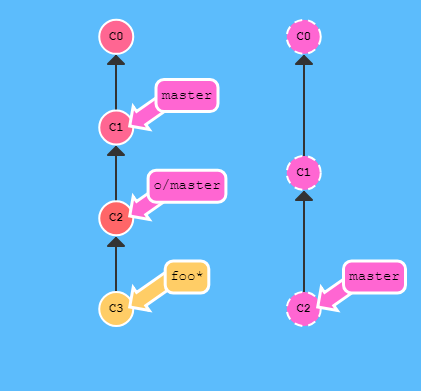
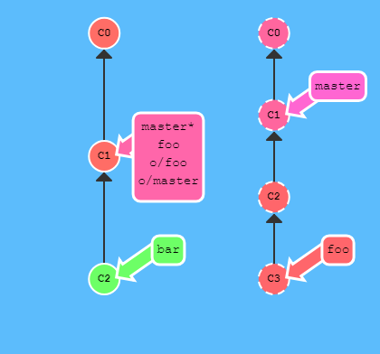

# 5. 명령어 학습

***

# 브랜치 변경 명령이 거부될 때 

현재 작업중인 브랜치에 커밋되지 않은 변경사항이 존재하는 상태에서 다른 브랜치로 체크아웃 하려할 때 거부당할 수가 있습니다. 다른 브랜치로 체크아웃 하는 명령은 충돌이 발생하지 않는 상황에서만 허락됩니다. 현재 브랜치가 C0이고 커밋하지 않은 변경내용이 있을 때 이동하려는 새 브랜치가 C0가 아닌 상황에서 내용이 다른 경우, 현재 브랜치의 변경 사항이 커밋되거나 숨겨질 때까지 브랜치를 전환 할 수 없습니다.

## 해결방법

이를 해결하는 방법은 여러가지가 있습니다. 다음 중 하나를 수행하면 됩니다.

* 변경사항을 커밋한 후 다른 브랜치로 이동합니다.

* 커밋되지 않은 변경사항을 `stash` 명령으로 임시로 보관한 후 다른 브랜치로 이동합니다.

* `git checkout -f 다른브랜치` 옵션을 추가하여 변경사항을 버리면서 다른 브랜치로 이동합니다.

* `git reset --hard HEAD` 또는 `git checkout HEAD -- [file]` 명령으로 변경사항을 버린 후 다른 브랜치로 이동합니다.

***

# 파일 관리

버전이 부여된 파일들을 재배치하거나 제거합니다.

### `$ git rm [file]`

워킹 디렉토리로부터 파일을 제거하고 삭제기록을 스테이지 영역에 등록 합니다.

### `$ git rm --cached [file]`

스테이지에 등록된 파일을 취소합니다. 워킹 디렉토리의 파일은 삭제하지 않습니다. `.gitignore` 파일에 무시대상으로 등록하는 작업을 잊어버린 경우에 사용합니다.

### `$ git mv [file-original] [file-renamed]`

파일명을 변경하고 스테이지 영역에 등록 합니다.

***

# 임시 저장

때때로 작업을 하다보면 작업이 완료되지 않아서 커밋하기는 싫지만 버릴 수도 없는 상황에 직면하게 됩니다. 커밋하기에는 불완전한 변경 사항을 임시로 보관하고 복원 시키는 방법입니다. 주로 현재 작업중인 브랜치에서 변경 내용을 커밋할 수 없는 상태인데 급하게 다른 브랜치로 이동해야 하거나 커밋 변경을 해야할 때 사용합니다.

### `$ git stash`

추적중인 수정된 파일들을 임시로 저장합니다. 수정된 내용은 제거됩니다. 기본적으로 WIP 명칭으로 저장됩니다. -u 옵션을 추가하여 새롭게 추가한 파일도 함께 stash 영역에 저장하도록 조치할 수 있습니다.

### `$ git stash save "your message here"`

임시로 저장할 때 메시지를 추가해 놓으면 나중에 작업내역을 복원할 때 작성한 메시지가 구분하는 작업에 도움을 줍니다.

### `$ git stash list`

모든 보관한 사항들의 리스트를 보여줍니다.

```console
stash@{0}: WIP on master: 049d078 added the index file
stash@{1}: WIP on master: c264051 Revert "added file_size"
stash@{2}: WIP on master: 21d80a5 added number to log
```

### `$ git stash apply stash@{2}`

보관한 이름을 입력하면 골라서 적용할 수 있습니다. 이름이 없으면 깃은 가장 최근의 보관한 내역을 적용합니다. apply 옵션은 단순히 Stash를 적용하는 것뿐입니다. Stash는 여전히 스택에 남아 있습니다. `git stash drop` 명령을 사용하여 해당 Stash를 제거할 수 있습니다.

깃은 Stash를 적용할 때 Staged 상태였던 파일을 자동으로 다시 Staged 상태로 만들어 주지 않습니다. git stash apply 명령을 실행할 때 --index 옵션을 주어 Staged 상태까지 적용할 수 있습니다.

### `$ git stash pop`

가장 최근에 숨겨진 파일을 복원합니다.

### `$ git stash drop`

가장 최근에 숨겨진 변경 사항을 버립니다. stash 아이디를 추가하여 특정 stash를 삭제할 수 있습니다.

### `$ git stash clear`

모든 stash 내역을 삭제합니다.

***

# 상태 관리

커밋은 깃 저장소에 디렉토리에 있는 모든 파일에 대한 스냅샷을 기록하여 영속화 하는 것입니다. 깃은 가능한 한 커밋을 작게 만들고자 하기때문에, 커밋할 때마다 디렉토리 전체를 복사하지는 않습니다. 각 커밋은 저장소의 이전 버전과 다음 버전의 `변경내역의 차이(Delta)`만을 저장합니다. 그래서 커밋은 앞서서 수행한 부모 커밋을 가리키게 됩니다.

### `$ git status`

커밋 대상의 모든 새로운 파일 혹은 수정된 파일 리스트를 보여줍니다. 추가로 현재 상태에서 작업을 취소할 수 있는 명령어를 보여줍니다.

### `$ git checkout [branch]`

지정한 브랜치로 이동합니다. 작업 대상인 커밋이 변화지 않는 경우, 수정되거나 추가된 파일은 유지됩니다.

### `$ git checkout (HEAD) -- [file]`

워킹 디렉토리에서 파일의 변경 부분을 버립니다. 최근 커밋된 버전으로 되돌리는 방법입니다. `checkout` 명령은 언제나 `--hard` 방식입니다. 따라서 최근 커밋이 인덱스에 반영되고 그 다음 작업으로 워킹 디렉토리에 반영됩니다. `HEAD`는 생략할 수 있습니다. 

### `$ git checkout [커밋해쉬값]`

커밋해쉬값이 C1 이라고 할 때, `HEAD -> master -> C1` 상태에서 위 명령을 수행하면 `HEAD -> C1` 상태가 됩니다. 결국 HEAD가 브랜치에서 분리됩니다. HEAD의 분리는 지난 커밋을 기준으로 새 브랜치를 만들고자 할 때 주로 사용됩니다.

### `$ git checkout master^`

master 위에 있는 부모를 체크아웃 합니다. HEAD는 브랜치와 분리되고 직접 커밋을 가리키게 됩니다. ^(캐럿) 한개는 한 단계 위에 부모를 지칭합니다. ^^ 두개는 두 단계 위에 부모를 지칭합니다.

### `git checkout HEAD^`

HEAD가 가리키는 커밋의 한 단계 위에 있는 부모 커밋을 체크아웃 합니다.

### `$ git add [file]`

파일을 스테이지에 등록합니다. 스테이지 상태의 파일은 아직 기록된 상태가 아닙니다. 파일의 기록을 위해서는 커밋 수행이 필요합니다.

### `$ git add .`

변경된 모든 파일을 스테이지에 등록합니다. 점(.)으로 시작하는 파일도 포함됩니다. 점(.) 대신 `*` 기호를 사용하면 점(.)으로 시작하는 파일은 포함하지 않습니다.

* `git add --dry-run`
실제로 인덱스에 등록되지 않습니다. 변화되는 정보를 표시만 합니다.

* `git add --all`
신규, 수정, 삭제 파일들이 대상

* `git add .`
신규, 수정 파일들이 대상

* `git add --update`
수정, 삭제 파일들이 대상

### `$ git add . -f`

ignore 파일이나 삭제한 파일 이력까지 커밋을 원하는 경우 -f 옵션을 이용합니다.

### `$ git commit -m "커밋 메시지"`

버전 히스토리에 파일 스냅샷을 영원히 기록합니다. 이것을 커밋한다고 표현합니다. -m 옵션을 붙이지 않으면 VI 에디터가 작동합니다. -a 옵션을 사용하면 변경된 모든 파일을 대상으로 바로 커밋을 수행하여 커밋전에 스테이지 등록작업을 생략할 수 있습니다.

### `$ git commit -m "커밋 메시지" --amend`

--amend 옵션을 주면 최종 커밋을 대체하는 새로운 커밋을 만들어 덮어씁니다. 아무런 변경 내역이 없다면 커밋 메시지만 변경하는 효과가 적용됩니다. 원격 저장소의 푸시한 커밋을 --amend 옵션으로 로컬 저장소에서 변경하지 마십시오. 원격 저장소에 있고 로컬 저장소에는 없는 커밋이 존재하게 되면 다음 push 작업 시 원격 저장소가 거부하기 때문입니다. 이 경우, 먼저 pull 하고 push 해야하는 번거로움이 발생합니다.

### `$ git revert [커밋해쉬값]`

각자의 컴퓨터에서 작업하는 로컬 브랜치의 경우 리셋(reset)을 잘 쓸 수 있습니다만, "히스토리를 고쳐쓴다"는 점 때문에 다른 사람과 같이 작업하는 리모트 브랜치에는 쓸 수 없습니다. 변경분을 되돌리고, 이 되돌린 내용을 다른 사람들과 공유하기 위해서는, git revert를 써야합니다.

커밋을 되돌릴 때, 지운내역을 커밋으로 남깁니다. 이미 다른 개발자들과 공유된 커밋(원격 저장소에 푸쉬된 커밋) 내역을 수정하는 것은 위험합니다. 대신, 커밋으로 발생한 변경 내역의 반대 커밋을 수행하여 변경 내역을 되돌리는 것이 안전합니다. 즉, 추가한 코드를 빼거나 지운 코드를 다시 추가하는 새로운 커밋을 수행하는 것을 의미합니다.

### `$ git revert HEAD`

HEAD가 master 브랜치를 가리키고 있는 상태에서 위 명령을 수행하면 master가 가리키는 커밋을 이전 커밋으로 되돌리는 커밋을 수행합니다. master는 새 커밋을 가리키도록 변경됩니다.

***

# 브랜치 관리

브랜치는 특정 커밋에 대한 참조(Reference)에 지나지 않습니다. 따라서 브랜치를 많이 만들어도 메모리나 디스크 공간에 부담이 되지 않습니다. 작업을 브랜치 하나에서 모두 작업하여 복잡하게 만들기 보다는 여러 브랜치로 나누어서 작업하는 것이 관리관점에서 더 좋습니다.

### `$ git branch`

현재 저장소 안의 모든 로컬 브랜치 리스트를 보여줍니다. * 기호는 현재 작업 중인 브랜치를 가리킵니다. -a 옵션을 사용하면 로컬 저장소에 있는 리모트 브랜치까지 조회할 수 있습니다.

### `$ git branch [branch-name]`

새로운 브랜치를 생성합니다. master 브랜치에서 위 명령을 수행했다면 새 브랜치 포인터가 생기면서 master 브랜치 포인터가 가리키는 커밋을 같이 가리키도록 설정됩니다. 새 브랜치가 만들어졌지만 여전히 HEAD는 작업 중인 master 브랜치를 가리키는 상태임을 기억하세요.

### `$ git checkout [branch-name]`

특정 브랜치로 전환하고 워킹 디렉토리를 업데이트합니다. 보다 자세히 설명하자면 HEAD 포인터가 가리키는 대상을 지정한 브랜치의 포인터로 변경합니다. checkout 명령은 언제나 --hard 방식입니다. 따라서, 커밋의 내용이 인덱스로 복사되고 인덱스의 내용이 워킹 디렉토리로 복사됩니다.

### `$ git checkout --force [branch-name]`

브랜치를 전환 할 때 인덱스 또는 워킹 디렉토리가 HEAD와 다른 경우에도 진행하도록 강제합니다. 이 명령은 변경 사항을 버린다는 것을 기억하셔야 합니다.

### `$ git merge [branch-name]`

HEAD가 가리키는 현재 작업중인 브랜치에 [branch-name]이 가리키는 커밋을 결합시킵니다. 깃의 머지는 두 개의 부모를 가리키는 특별한 커밋을 만들어 냅니다. 두개의 부모가 있는 커밋이라는 것은 "한 부모의 모든 작업내역과 나머지 부모의 모든 작업, 그리고 그 두 부모의 모든 부모들의 작업내역을 포함한다"라는 의미가 있습니다.

지정한 브랜치의 루트 커밋이 현재 브랜치의 커밋과 같은 경우 작업 중인 브랜치의 포인터가 Fast-Forward 되는 방식으로 결합됩니다. 이때 머지 커밋은 생기지 않습니다. 그렇지 않으면 Three-Way 방식의 머지 작업이 이루어 지는데 이 때는 자동으로 머지 커밋이 추가됩니다.

### `$ git branch -d [branch-name]`

특정 브랜치를 삭제합니다

### `$ git branch -m [old-branch] [new-branch]`

브랜치명을 변경합니다.

***

# 히스토리(커밋의 기록) 리뷰

프로젝트의 진행상황을 살펴보고 점검합니다

### `$ git log`

현재 브랜치의 버전 히스토리를 보여줍니다. 옵션은 다음 사이트를 참고하세요.

### `log options`

[Git의-기초-커밋-히스토리-조회하기](https://git-scm.com/book/ko/v1/Git%EC%9D%98-%EA%B8%B0%EC%B4%88-%EC%BB%A4%EB%B0%8B-%ED%9E%88%EC%8A%A4%ED%86%A0%EB%A6%AC-%EC%A1%B0%ED%9A%8C%ED%95%98%EA%B8%B0)

### `$ git log --follow [file]`

파일의 버전 히스토리를 보여줍니다.

### `git log --branches --graph --decorate --oneline`

모든 브랜치의 히스토리를 그래픽컬하고 간소하게 한줄로 보여줍니다. 

### `$ gitk`

히스토리를 GUI 화면으로 보여줍니다.

### `$ git diff`

워킹 디렉토리와 스테이지 영역인 Index의 차이를 비교합니다. 주로 충돌(Conflict) 발생 시 충돌지점을 찾기위해서 사용합니다. 충돌을 해결한 후 작업 대상을 add 하여 충돌의 해결을 마킹해야 합니다.

### `$ git diff --cached`

스테이지 영역과 커밋의 차이를 비교합니다. `--cached` 옵션 대신 `--staged` 옵션을 사용할 수 있습니다.

### `$ git diff HEAD`

워킹 디렉토리와 HEAD가 가리키는 커밋의 차이를 비교합니다.

### `$ git diff [first-branch] [second-branch]`

두 브랜치 간의 컨텐츠 차이점을 보여줍니다.

### `$ git diff [branch] [origin/branch]`

로컬 브랜치와 원격 브랜치간의 차이점을 보여줍니다.

###  `$ git diff [커밋해쉬값] [커밋해쉬값]`

두 커밋끼리 비교하여 차이점을 보여줍니다.

### `$ git show [커밋해쉬값]`

특정 커밋의 컨텐츠 변경 사항을 출력합니다.

***

# reset

reset은 과거 상태로 되돌아 가는 것입니다. push 작업 후에는 다른 사람의 코드에 문제를 일으킬 소지가 있으므로 사용하지 말고 대신 revert 명령을 사용하는 것이 좋습니다.

### `$ git reset --soft HEAD~`

HEAD가 가리키는 커밋의 부모의 커밋으로 되돌립니다. 인덱스와 워킹 디렉토리의 내용은 유지됩니다.


### `$ git reset (--mixed) [commit]`

지정한 커밋 이 후의 모든 커밋을 되돌립니다. 로컬에 변경사항은 보존합니다. 옵션을 생략하면 `--mixed`가 적용됩니다.


### `$ git reset --hard [commit]`

지정한 커밋 이 후의 모든 커밋을 되돌립니다. `--hard` 옵션은 매우 중요합니다. reset 명령을 위험하게 만드는 유일한 옵션입니다. 깃에서 데이터를 실제로 삭제하는 방법이 별로 없는데 이 방법은 그 중 하나입니다. `--hard` 옵션은 되돌리는 것이 불가능합니다. 이 옵션을 사용하면 워킹 디렉토리의 파일까지 강제로 덮어쓰게 됩니다. 

그림의 예제는 파일의 v3버전을 아직 깃이 커밋으로 보관하고 있기 때문에 `git reflog` 를 이용해서 다시 복원할 수 있지만 만약 커밋한 적 없다면 깃이 덮어쓴 데이터는 복원할 수 없다는 점을 명심해야 합니다.


### `$ git reset [file]`

git reset은 브랜치로 하여금 예전의 커밋을 가리키도록 이동시키는 방법으로 변경 내용을 되돌립니다. 이런 관점에서 "히스토리를 고쳐쓴다"라고 말할 수 있습니다. 즉, git reset은 마치 애초에 커밋하지 않은 것처럼 예전 커밋으로 옮기는 것입니다.


파일을 언스테이지(Unstage) 상태로 변경시키나 파일 컨텐츠는 그대로 보존합니다. `git reset --mixed HEAD -- [file]` 명령의 줄임입니다. 

`HEAD는 포인터이고 포인터가 가리키는 것은 압축된 BLOB 파일이므로 커밋에서 일부 파일들을 부분적으로 되돌리는 건 불가능합니다.` 하지만, Index나 워킹 디렉토리는 일부분만 갱신할 수 있습니다. 그래서 파일을 지정한 경우 변경 대상은 커밋은 건너뛰고 옵션에 따라서 Index 영역 및 워킹 디렉토리 영역만이 작업대상이 됩니다.

`gid add [file]` 명령으로 인덱스 영역을 워킹 디렉토리와 같게 만들었다면 `git reset [file]` 명령은 정 반대의 작업을 수행하는 것이 됩니다. 이것이 `git status` 명령의 수행결과에서 `git reset [file]` 명령을 보여주는 이유다. 이 명령으로 파일을 Unstaged 상태로 만들 수 있다. 


### `$ git reset eb43bf -- file.txt`

특정 커밋을 명시하면 깃은 `HEAD에서 파일을 가져오는 것`이 아니라 지정한 커밋에서 파일을 가져온다.


***

# reset vs checkout

아마도 checkout 명령과 reset 명령에 어떤 차이가 있는지 궁금할 것이다. reset 명령과 마찬가지로 checkout 명령도 위의 세 트리를 조작한다.

브랜치를 checkout 하면, HEAD가 새로운 브랜치를 가리키도록 바뀌고, 새로운 커밋의 스냅샷을 Index에 놓는다. 그리고 Index의 내용을 워킹 디렉토리로 복사한다.

reset 명령은 checkout 명령처럼 HEAD가 가리키는 브랜치 포인터를 바꾸지는 않는다. HEAD는 계속 현재 브랜치 포인터를 가리키고 있고, 현재 브랜치 포인터가 가리키는 커밋을 바꾼다.


checkout과 reset 명령은 되돌린다는 점에서 비슷해 보이지만 결정적인 차이점이 있다.

* `git checkout 체크섬값`
해당 브랜치 이후에 변경 내역이 사라진다.

* `git reset --soft 체크섬값 / git reset --mixed 체크섬값`
해당 브랜치 이후에 변경 내역이 유지된다.

##  checkout 파헤치기

checkout 명령이 어떻게 수행되는지 파악하면 reset 명령과의 차이점을 알 수 있을 것이다. checkout 명령도 reset 처럼 파일 경로를 쓰느냐 안 쓰느냐에 따라 동작이 다르다.

#### 파일 경로 없음

`git checkout [branch]` 명령은 `git reset --hard [branch]` 명령과 비슷하게 [branch] 가 가리키는 커밋의 스냅샷을 기준으로 세 트리를 조작한다. 하지만, 두 가지 사항이 다르다.

1. 첫 번째로 reset --hard 명령과는 달리 checkout 명령은 워킹 디렉토리를 안전하게 다룬다. 저장하지 않은 것이 있는지 확인해서 날려버리지 않는다는 것을 보장한다. 사실 보기보다 좀 더 똑똑하게 동작한다. 워킹 디렉토리에서 합병 작업을 한번 시도해보고 변경하지 않은 파일만 업데이트한다. 반면 reset --hard 명령은 확인도 하지 않고 단순히 모든 것을 바꿔버린다.

2. 두 번째 중요한 차이점은 어떻게 checkout 명령이 HEAD를 업데이트 하는가이다. reset 명령은 HEAD가 가리키는 브랜치 포인터를 움직이지만(브랜치 Refs를 업데이트하지만), checkout 명령은 HEAD 포인터 자체를 다른 브랜치로 옮긴다.

예를 들어 각각 다른 커밋을 가리키는 master 와 develop 브랜치가 있고 현재 워킹 디렉토리는 develop 브랜치라고 가정해보자(즉 HEAD는 develop 브랜치를 가리킨다). `git reset master` 명령을 실행하면 develop 브랜치는 master 브랜치가 가리키는 커밋과 같은 커밋을 가리키게 된다. 반면 `git checkout master` 명령을 실행하면 develop 브랜치가 가리키는 커밋은 바뀌지 않고 HEAD가 master 브랜치를 가리키도록 업데이트된다. 이제 HEAD는 master 브랜치를 가리키게 된다.

그래서 위 두 경우 모두 HEAD는 결과적으로 A 커밋을 가리키게 되지만 방식은 완전히 다르다. reset 명령은 HEAD가 가리키는 브랜치의 포인터를 옮겼고 checkout 명령은 HEAD 포인터 자체를 옮겼다.

#### 파일 경로 있음

checkout 명령을 실행할 때 파일 경로를 줄 수도 있다. reset 명령과 비슷하게 HEAD는 움직이지 않는다. 동작은 `git reset [branch] file` 명령과 비슷하다. Index의 내용이 해당 커밋 버전으로 변경될 뿐만 아니라 워킹 디렉토리의 파일도 해당 커밋 버전으로 변경된다. 완전히 `git reset --hard [branch] file` 명령의 동작이랑 같다. 워킹 디렉토리가 안전하지도 않고 HEAD도 움직이지 않는다.

***

# 변경사항 연동하기

원격(URL)을 등록하고 저장소 기록을 주고 받습니다.

### `$ git fetch [remote]`

원격 저장소로부터 프로젝트와 프로젝트 히스토리를 다운로드합니다. master 브랜치는 변화가 없습니다. `origin/master` 브랜치는 이제 원격 저장소와 동일한 상태로 변화되었습니다. 개발자가 직접 로컬 저장소의 커밋과 가져온 원격 저장소의 커밋을 병합해야 합니다. 충돌이 발생한다면 개발자가 직접 충돌을 해결하고 커밋해야 합니다. 주로 충돌이 예상될 때 사용합니다.

* 원격 저장소에는 있지만 로컬에는 없는 커밋들을 다운로드 받습니다.
* 로컬의 `origin/master`가 가리키는곳을 원격 저장소에 `master` 브랜치가 가리키는 곳과 일치하도록 업데이트합니다.

`git fetch`는 본질적으로 로컬에서 나타내는 원격 저장소의 상태를 실제 원격 저장소의 상태와 동기화합니다. `git fetch`는 그러나, 여러분의 로컬 브랜치의 상태는 전혀 바꾸지 않는습니다. 여러분의 `master` 브랜치도 업데이트하지 않고 파일 시스템의 모습이던 그 어떤것도 바꾸지 않습니다.

이것을 이해하는게 아주 중요한데, 왜냐하면 수 많은 개발자들이 `git fetch`를 하면 자신의 로컬 작업이 변경되어 원격 저장소의 모습을 반영해 업데이트 될것이라고 생각하기 때문입니다. 앞의 과정에 필요한 데이터를 다운로드는 하지만, 실제로 로컬 파일들이나 브랜치를 변경하지는 않습니다. 간단하게 `git fetch`를 다운로드 단계로 생각할 수 있습니다.

이제 우리의 작업을 업데이트해서 변경들을 반영하는 방법은 여러가지 있습니다. 새 커밋들을 로컬에 내려받은 이후에는 그냥 다른 브랜치에있는 일반 커밋처럼 활용할 수 있습니다. 이런 명령들을 실행할 수 있다는 뜻 입니다.

* `git cherry-pick origin/master`
* `git rebase origin/master`
* `git merge origin/master`
* 기타 등등

사실 원격 저장소의 변경을 fetch하고 그이후에 merge하는 작업의 과정이 워낙 자주있는 일이라서 git은 이 두가지를 한번에 하는 명령을 제공합니다. 이 명령어는 `git pull` 입니다.

### `$ git merge [remote] [branch]`

원격 브랜치를 현재의 로컬 브랜치와 결합합니다.

### `$ git push [remote] [branch]`

원격 저장소에 로컬 브랜치의 커밋을 업로드합니다.

공유된 작업을 내려받는것의 반대는 작업을 업로드해 공유하는것입니다. 그렇다면 `git pull` 당기기의 반대는 `git push` 미는 겁니다.

`git push`는 여러분의변경을 정한 원격저장소에 업로드하고 그 원격 저장소가 여러분의 새 커밋들을 합치고 갱신하게 합니다. `git push`가 끝나고 나면, 여러분의 친구들은 원격저장소에서 여러분의 작업을 내려받을 수 있게됩니다.

여러분은 `git push`를 작업을 "공개"하는 과정이라고 생각해도 될것입니다.

`git push`를 매개변수 없이 사용하는 디폴트 행동은 `push.default`라 불리는 git의 설정에 따라 결정 됩니다. 이 설정의 기본값은 여러분이 사용하는 git 버전에 따라 다릅니다만, 보통 origin 값으로 사용합니다.

로컬 `origin/master`는 `git pull(또는 git fetch), git push` 명령을 사용하는 순간 원격 저장소와 같은 상태가 됩니다. 그 후 여러분의 친구들이 원격저장소를 상대로 작업을 수행하면 로컬 `origin/master`는 원격 저장소와 다른 상태가 됩니다.

### `$ git push [remote] --all`

원격 저장소에 모든 로컬 브랜치 커밋을 업로드합니다.

### `$ git push [remote] --tags`

하나의 로컬 브랜치 또는 `--all` 옵션을 사용하는 경우 태그는 자동으로 업로드 되지 않습니다. `--tags` 옵션을 추가하여 태그 정보도 업로드 되도록 조치합니다.

### `$ git remote add origin [url]`

url이 가리키는 remote 저장소를 origin이라는 이름으로 추가합니다. 다음부터 간단히 origin이라는 별칭으로 remote 저장소를 지칭할 수 있습니다.

### `$ git remote -v`

등록된 remote 저장소 리스트를 조회합니다.

### `$ git push -u origin master`

origin이 가리키는 원격 저장소에 로컬 master 브랜치에 내용을 업로드합니다. -u 옵션은 upstream(상류 저장소)을 의미합니다. 이 옵션을 사용하면 다음 부터는 간단히 git push 명령으로 업로드하고 git pull 명령으로 다운로드해서 로컬 저장소에 병합할 수 있습니다. 상류 저장소는 최초 저장소를 의미하며 다른 개발자가 fork 할 때 fork 한 저장소와 기원이 되는 저장소를 구분하기 위한 개념입니다.

### `$ git pull`

원격 저장소의 프로젝트와 프로젝트 히스토리를 다운로드 합니다. 다운로드 후 자동으로 로컬 브랜치에 병합하는 작업이 이루어 집니다. git pull 작업은 `git fetch + git merge` 작업과 같습니다. 주로 충돌이 예상되지 않을 때 사용합니다.

```
로컬 저장소
C0      <--       C1      <--     C2
                  origin/master   master

원격 저장소
C0      <--       C1      <--     C3
                                  master

원격 저장소에 로컬 저장소에는 존재하지 않는 C3 커밋이 존재하므로
로컬 저장소보다 빠른 상태입니다.

git fetch && git merge origin/master

로컬 저장소
C0      <--       C1      <--     C2      <--     C4
                          <--     C3              master
                                  origin/master       

원격 저장소
C0      <--       C1      <--     C3
                                  master                     

git fetch 명령으로 원격 저장소의 C3 커밋이 다운로드 됩니다.
로컬 저장소의 origin/master가 C3를 가리키도록 변경됩니다.
HEAD가 master를 가리키고 있다면 git merge origin/master
명령으로 master가 가리키는 C2에 origin/master가 가리키는
C3를 결합시킵니다. 결합결과로 C4 커밋이 만들어 집니다.
master가 C4를 가리키도록 변경됩니다.
```

원격 저장소의 C3를 fetch로 내려 받고 git merge origin/master로 병합했습니다. 로컬 master 브랜치는 원격 저장소의 새 작업들을 반영하게 됩니다.

### `git fetch origin; git diff --name-only master origin/master`

origin이 가리키는 원격 저장소로부터 다운로드 합니다. 로컬 master 브랜치와 origin/master 브랜치를 비교하여 어떤 파일들이 갱신되는지 조회합니다.

***

# 커밋에 태그 붙이기

프로젝트의 히스토리(작업 이력)에서 중요한 지점들에 영구적으로 표시를 할 방법이 존재합니다. 태그는 주요 릴리즈나 큰 브랜치 병합(merge)이 있을때 이를 기록하기 위해 존재합니다. 태그는 특정 커밋들을 브랜치로 참조하듯이 영구적인 "milestone(이정표)"으로 표시합니다.

중요한 점은, 태그는 커밋들이 추가적으로 생성되어도 절대 움직이지 않는다는 것입니다. 그래서 여러분은 태그를 "체크아웃"한 후에 그 태그에서 어떤 작업을 완료할 수 없습니다. 태그에 직접 커밋을 할 수 없다는 얘기입니다. 태그는 커밋 트리에서 특정 지점을 표시하기 위한 닻같은 역할을 수행합니다.

### `$ git tag 1.0`

HEAD가 가리키는 지점에 light weight 태그를 추가합니다.

### `$ git log -2`

가장 최근 두개의 커밋만을 조회합니다.

### `$ git tag 2.0 커밋해쉬값`

특정 커밋에 태그를 추가합니다. 만약 커밋해쉬값을 지정해주지 않으면 깃은 HEAD가 가리키는 지점에 태그를 붙일 것입니다.

### `$ git tag -a 3.0 커밋해쉬값`
-a 옵션을 사용하여 annotated 태그를 추가하면 태그 정보를 편집할 수 있는 vi 에디터가 기동합니다. 보다 상세한 설명을 추가할 수 있습니다. -m 옵션 다음 메시지를 바로 작성하면 vi 에디터는 기동하지 않습니다.

### `$ git show-ref --tags`

관련 커밋 ID와 함께 로컬 저장소에서 사용 가능한 참조를 표시합니다.

### `$ git show 3.0`

3.0 태그가 붙은 정보를 조회합니다.

### `$ git tag -d 3.0`

3.0 태그를 삭제합니다.

### `$ git checkout 태그명`

태그명으로 체크아웃 할 수 있습니다. 단, 태그에 직접 커밋을 할 수 없다는 것을 기억하세요.

***

# show

git show 명령은 Git 개체를 사람이 읽을 수 있도록 요약해서 보여줍니다. 태그나 커밋 정보를 보고 싶을 때 이 명령을 사용합니다.

### `$ git show`

현재 브랜치의 가장 최근 커밋 정보를 확인합니다.

### `$ git show 커밋해쉬값`

특정 커밋 정보를 확인합니다.

### `$ git show HEAD`

HEAD 포인터가 가리키는 커밋정보를 확인합니다.

### `$ git show 커밋해쉬값 또는 HEAD^`

^표시 한 개면 한 개 전 커밋을 대상으로 조회합니다. 예를 들어 `master^`는 "master의 부모"와 같은 의미가 되고 `master^^` 는 "master의 조부모(부모의 부모)"를 의미합니다

### `$ git show 커밋해쉬값 또는 HEAD~숫자`

~숫자는 명시적으로 몇 개 전인지 표시하여 사용합니다. ~ 표시와 ^ 표시는 혼합 사용이 가능합니다.

***

# 기타

### `$ git reflog`

Git은 자동으로 브랜치와 HEAD가 지난 몇 달 동안에 가리켰었던 커밋을 모두 기록하는데 이 로그를 Reflog라고 부릅니다. HEAD의 변화를 확인하시고 싶을 때 git reflog 명령을 사용합니다.

### `$ git rebase master`

merge 명령말고 브랜치끼리의 작업을 접목하는 방법은 리베이스(Rebase)입니다. 리베이스는 기본적으로 커밋들을 모아서 복사한 뒤, 다른 곳에 떨궈 놓는 것입니다.

다른 브랜치에서 커밋을 한 상태에서 master 브랜치에서 추 후 커밋을 한 경우, 다른 브랜치에서 위 명령으로 다른 브랜치의 루트 커밋을 master 브랜치가 가리키는 커밋으로 이동시킵니다. 그런 다음 master를 Fast-Foward하여 다른 브랜치를 가리키게 하면 한 줄기의 히스토리를 얻을 수 있습니다. 리베이스를 쓰면 저장소의 커밋 로그와 이력이 한결 깨끗해집니다.

### `$ git rebase bugFix`

master 포인터가 bugFix 포인터가 가리키는 커밋보다 지난 커밋을 가리키고 있다면 위 명령으로 master 브랜치 포인터를 앞으로 Fast-Foward 할 수 있습니다.

* bugFix 포인터가 가리키는 커밋을 master 앞에 떨구려고 보니 이미 bugFix 포인터가 가리키는 커밋이 master 포인터가 가리키는 커밋보다 앞에 있으므로 이 작업은 건너 뜁니다.
* master 포인터가 bugFix 포인터가 가리키는 커밋을 가리키도록 변경합니다.

### `$ git branch -f master HEAD~3`

위 명령을 사용하면 강제로 master 브랜치 포인터를 HEAD에서 세번 위에 있는 커밋으로 옮길 수 있습니다. -f 옵션으로 특정 브랜치 포인터를 특정 커밋으로 옮길 수 있습니다.

### `git blame [file]`

해당 파일의 수정 이력을 볼 수 있습니다.

### `git fetch origin; git reset --hard origin/master`

로컬에 있는 모든 변경 내용과 확정본을 포기하기 위해서 원격 저장소의 최신 이력을 가져오고 로컬 master 브랜치가 그 이력을 가리키도록 조치합니다.

***

# cherry-pick

히스토리를 하나의 가지로 관리하려고 master브랜치에 병합하기 전 master 브랜치를 기반으로  Rebase 할 수 있습니다. rebase는 master 브랜치를 Fast-Forward시켜 평평한 히스토리를 유지할 수 있는 방법입니다.

한 브랜치에서 다른 브랜치로 작업한 내용을 옮기는 또 다른 방법으로 Cherry-pick이 있습니다. Cherry-pick은 커밋 하나만 Rebase하는 것입니다. 커밋 하나로 Patch 내용을 만들어 master 브랜치에  적용을 하는 것입니다. 단, 그 커밋이 현재 HEAD가 가리키고 있는 커밋이 아니어야합니다. 다른 브랜치에 있는 커밋 중에서 하나만 고르거나 다른 브랜치에 커밋이 하나밖에 없을 때 Rebase보다 유용합니다.

### `$ git cherry-pick 커밋해쉬값(C2) 커밋해쉬값(C4)`

번거로울 수 있는 브랜치 정리 작업(rebase -i)을 피하거나 여러 브랜치의 이력을 그대로 남기고자 한다면 master 브랜치는 새로 파일을 만들거나 수정하지말고 오직 병합작업만 수행하는 것이 좋습니다.

HEAD가 master브랜치를 가리키는 상태라고 가정합니다. 다른 브랜치에 C2, C3, C4 커밋이 존재할 때 C2, C4 커밋만을 복사해서 master 브랜치에 붙여 넣고 싶습니다. 이 때 위 명령을 사용하면 됩니다. 다른 브랜치에 커밋은 그대로 보존됩니다. 커밋해쉬값은 유니크하기 때문에 여러 브랜치에 존재하는 다수의 커밋을 한 번에 작업으로 체리픽 작업을 수행할 수 있습니다.

***

# Squash(대화방식 리베이스)

체리픽은 여러분이 원하는 커밋이 무엇인지 알때(각각의 커밋해시값) 아주 유용합니다. 하지만 원하는 커밋을 모르는 상황에서는 대화형 리베이스를 사용하면됩니다. 리베이스할 일련의 커밋들을 검토할 수 있는 가장 좋은 방법입니다. 스쿼시는 여러 커밋을 합치는 작업을 의미합니다.

인터렉티브 리베이스가 의미하는 뜻은 rebase 명령어를 사용할 때 -i 옵션을 같이 사용한다는 것입니다. 이 옵션을 추가하면, git은 리베이스의 목적지가 되는 곳 아래에 복사될 커밋들을 보여주는 vi를 띄울것 입니다. 각 커밋을 구분할 수 있는 각각의 해시들과 메시지도 보여줍니다.

* pick : 해당 커밋을 남긴다.
* reword : 해당 커밋을 남긴다. 커밋 메시지 변경을 위해서 메시지 수정창이 뜬다.
* edit : rebase 작업이 잠시 중단된다. 커밋을 amend 할 수 있다.
* squash : 해당 커밋을 이용하고 이전 커밋과 합친다. 커밋 메시지도 합쳐지고 메시지 수정창이 뜬다.
* fixup : squash와 같지만 이 커밋 메시지는 버린다.
* exec : 쉘을 이용한 명령을 수행한다.
* drop : 커밋을 삭제한다.

인터렉티브 리베이스 대화창이 열리면, 3가지를 할 수 있습니다:

* 적용할 커밋들의 순서를 UI를 통해 바꿀수 있습니다.
* 원하지 않는 커밋들을 뺄 수 있습니다.
* 커밋을 스쿼시(squash)할 수 있습니다.

### `$ git rebase -i HEAD~4`

4개의 커밋을 대상으로 스쿼시 작업을 수행합니다.

### rebase 시 발생하는 충돌 해결방법

* git rebase --continue
충돌을 해결한 후 rebase 작업을 계속 진행하여 완료합니다.

* git rebase --skip
병합 대상(master) 브랜치의 내용이 그대로 복사됩니다. 다시 git rebase 명령을 실행할 수 없습니다. 권장하지 않는 방법입니다.

* git rebase --abort
명령을 취소합니다.

병합한 흔적을 남기고자 할 때 --no-ff 라는 옵션을 사용합니다.

### Remote repository 에 squash 한 commit push 하기

가능하면 이미 push하지 않은 작업만 squash 하는것을 추천합니다. push와 pull 작업이 살짝 번거로워 집니다.

아무도 squash 한 commit 들을 pull 하지 않았다는 가정 하에 이 작업이 수행되어야 한다. 누군가 이미 해당 commit 들을 pull 했는데 그것을 rebase -i 를 통해 수정하고 commit 하면 큰일 날 수 있다.

대표적으로 이러한 squash 작업이 필요한 경우가 Open Source repository 를 fork 해서 수정한 후에 pull request 를 날렸는데 수정요청이 들어올 때이다.

Pull request 가 여러개의 commit 으로 이루어지게 되면 중간에 완성되지 않은 commit 이 존재하는 것이기 때문에 관리상에 어려움이 생길 수 있다. 이를 방지하기 위해 squash 를 통해 제대로 동작하는 하나의 commit 으로 만들어 주는 것이 좋다.

`git push origin <branch-name> --force`

또는

`git push origin +<branch-name>`

`--force`는 푸시 된 모든 참조에 적용되므로 `push.default`가 일치하도록 설정된 경우 또는 `remote.*.push`로 구성된 여러 푸시 대상과 함께 사용하면 그 참조 이외의 `refs`를 덮어 쓸 수 있습니다. 현재 지점 (원격 상대방보다 엄격하게 뒤에있는 로컬 참조 포함).

`하나의 브랜치 만 강제로 푸시하려면 'refspec'앞에 '+'를 사용하여 푸시합니다.`

`git fetch && git merge --squash`

병합 작업 시 가져오는 브랜치에 모든 커밋을 하나의 커밋으로 뭉개서 작업 대상 브랜치에 적용한다.

***

# 부모를 선택하는 방법

~ 수식처럼 ^ 수식 또한 뒤에 숫자를 추가 할 수 있습니다.

몇개의 세대를 돌아갈지 정하는 것 대신(~의 기능) ^수식은 병합이된 커밋에서 어떤 부모를 참조할지 선택할 수 있습니다. 병합된 커밋들은 다수의 부모를 가지고 있다는것을 기억하시나요? 어떤 부모를 선택할지 예측할 수가 없습니다.

Git은 보통 병합된 커밋에서 "첫"부모를 따라갑니다. 하지만 ^수식을 를 숫자와 함께 사용하면 앞의 디폴트 동작대로가 아닌 다른 결과가 나타납니다.

### `$ git checkout master^`

현재 master가 가리키는 커밋은 병합 커밋이라고 가정합니다. master를 수식없이 체크아웃한다면 병합된 커밋의 첫 부모를 따라 HEAD가 올라갈 것입니다.

### `$ git checkout master^2`

두 번째 부모를 따라 HEAD가 올라갈 것입니다.

### `$ git checkout HEAD~^2~2`

* ~^2 : 두 번째 부모를 따라 2번 올라갑니다.
부모가 하나일 때 ^ 설정은 아무런 영향을 미치지 않습니다.
* ~2 : 첫 번째 부모를 따라 2번 올라갑니다.

### `$ git checkout [커밋해쉬값] && git branch bugWork`

현재 HEAD는 master 브랜치를 가리키고 있다고 가정합니다. 이 상황에서 한참 이전 커밋을 기준으로 새로운 브랜치 bugWork를 생성합니다.

***

# `push`의 인자들

push를 하면 git이 push를 할 대상인 원격저장소 브랜치를 현재 작업중인 브랜치에 설정된 속성("추적" 대상)을 통해 알아냅니다. 이것은 인자를 넣지않고 실행할 때 일어나는 것 입니다. 그런데 git push에 다음과 같은 형식으로 선택적으로 인자를 사용할 수도 있습니다.

`git push [remote] [place]`

[place] 인자가 무엇을 의미할것 같나요? 세부사항은 알아보기 전에 예시부터 봅시다. 다음 명령어를 보세요.

`git push origin master`

해석해 보면, 내 저장소에 있는 "master"라는 이름의 브랜치로 가서 모든 커밋들을 수집합니다. 그다음 "origin"의 "master"브랜치로 가서 이 브랜치에 부족한 커밋들을 채워 넣고 완료 되면 알려줍니다.

master를 "place" 인자로 지정해서 우리가 git에게 어디서부터 커밋이 오는지, 그리고 어디로 커밋이 가야하는지 알려줍니다. 두 저장소간에 동기화 작업을 할 "장소"를 지정해 주는것이라고 볼 수 있습니다.

깃이 알아야 할 것은 다 알려줬기 때문에, 깃은 현재 우리가 체크아웃 한 브랜치는 무시하고 명령을 수행합니다.

`git checkout C0; git push`

위 명령은 실패합니다. HEAD가 원격저장소를 추적하는 브랜치에 체크아웃 되어 있지 않은 상태에서 push 명령을 내렸기 때문이죠.

`git checkout C0; git push origin master`

위 명령처럼 사용하면 성공합니다.

***

# `git push` 인자에 대한 세부사항

앞서서 우리는 master를 커밋의 근원이되는 source와 목적지가 되는 destination으로 명령어의 인자로 넣어줌으로써 지정해줬습니다. 여러분은 이런 생각이 들 수 있어요. 내가 source와 destination이 다르길 원하면 어떻게 해야되지? 로컬의 foo 브랜치에서 원격의 bar 브랜치로 커밋을 push 하고 싶으면 어떻게 해야 되지?

source와 destination을 모두 지정하기 위해서는 간단히 두개를 콜론 기호를 사이에 두고 표현하면 됩니다.

`git push origin [source]:[destination]`

이것을 일반적으로 `colon refspec(콜론 참조스펙)`이라고 부릅니다. 참조스펙은 그냥 "git이 알아낼 수 있는 위치"를 이름 붙여서 말하는거에요. 

예: 브랜치 'foo' 또는 HEAD~1

source와 destination을 따로 지정할 수 있게 되면서, 이제 원격관련 명령어를 좀 멋지고 정확히 사용할수 있게 되었어요.

`git push origin foo^:master`

깃은 foo^의 위치를 알아내서 원격 저장소에 아직 반영되지 않은 커밋들을 업로드하고 destination 브랜치인 master를 갱신합니다. 만약 destination 브랜치가 없다면 자동으로 생성됩니다.



***

# `git fetch` 인자에 대한 세부사항

여태까지 우리는 git push 인자들에 대해 배워봤습니다. 이 멋진 [place] 인자 그리고 콜론 참조스펙도 말이죠([source]:[destination]). 우리가 알아낸 이 지식을 git fetch에도 적용 할 수 있으려나요?

당연하죠! git fetch에 넘기는 인자들은 사실 git push의 그것들과 아주 아주 비슷합니다. 같은 컨셉으로 적용되지만 방향이 반대일 뿐이죠. 커밋을 업로드하는게 아니라 다운받는 것이니까요.

git fetch에 다음 명령어와 같이 place를 지정해주면:

`git fetch origin foo`

깃은 원격 저장소의 foo 브랜치로 가서 현재 로컬에 없는 커밋들을 가져와 로컬의 'origin/foo' 브랜치 아래에 추가 할 것입니다.

"source와 destination를 모두 직접 지정해주면 어떻게될까요?

여러분이 커밋을 직접 로컬 브랜치로 fetch할 열의가 있다면 콜론 참조스펙으로 지정해서 할 수 있습니다. `하지만 체크아웃된 브랜치에 fetch할 수는 없고 체크아웃되지 않은 브랜치만 가능합니다.`

주의 할 점이 하나 있는데 [source]는 이제 받아올 커밋이 있는 원격에 있는 place를 넣어줘야하고 [destination]은 그 커밋들을 받아올 local의 place를 인자로 넣어줘야 합니다. git push와 정반대로 하는거죠. 데이터를 반대의 방향으로 옮기는 작업이니 이게 더 납득이 갑니다.

언급한 것 처럼 실제로 이것을 사용하는 개발자들은 많지 않습니다. 이것을 소개하는것은 fetch와 push가 방향이 반대일뿐 컨셉이 비슷하다는 것을 설명하기 위해서 입니다.

`git fetch origin foo~1:bar`

깃이 foo~1을 origin의 place로 지정하고 커밋들을 내려받아 bar(로컬 브랜치)에 추가했습니다. foo와 origin/foo는 갱신되지 않습니다. destination을 지정해줬기 때문입니다.



`git fetch`를 인자없이 수행하면 원격저장소에서 모든 원격 브랜치들의 커밋들을 내려받습니다.

`git fetch`는 로컬의 원격 브랜치가 아닌 브랜치는 갱신하지 않습니다. 커밋들을 내려받기만 합니다. 여러분이 확인해보고 나중에 병합할 수 있도록 말이죠.

***

# 없음을 의미하는 인자

깃은 [source] 인자를 두가지 방법으로 이상하게 사용합니다. 이 두가지 오용은 여러분이 `git push`와 `git fetch`에 source에 "없음"을 지정할 수 있기 때문에 나타납니다. "없음"을 지정하는 방법은 인자로 아무것도 안쓰면 됩니다.

`git push origin :side`

`"없음"을 원격 브랜치로 push하면 무엇을 할까요? 원격저장소의 그 브랜치를 삭제합니다!` Null을 푸쉬해서 원격 저장소의 브랜치를 삭제한다고 이해하세요. 이 때, 로컬의 origin/side 브랜치도 같이 삭제가 됩니다.

`git fetch origin :bar`

`"없음"을 fetch하면 로컬에 새 브랜치를 만듭니다.` 기괴합니다. Null을 가져오는 것이므로 실제로 다운로드 할 것은 없는 상태에서 로컬의 해당 브랜치가 없으니 만들기는 한다고 이해하세요.

***

# `git pull` 인자에 대한 세부사항

`git fetch`와 `git push`의 인자들을 다 알아 보았기 때문에 `git pull`에서 더 설명할게 사실 없습니다.

`git pull`은 결국 merge가 따라오는 fetch 그 자체이기 때문이죠. `git fetch`와 같은 인자를 사용하며 커밋들을 어디로 merge되는지만 알면 됩니다.

`git pull origin foo`

위 명령은 다음 명령어들과 같습니다.

`git fetch origin foo; git merge origin/foo`

그리고,

`git pull origin bar~1:bugFix`

위 명령은 다음 명령어들과 같습니다.

`git fetch origin bar~1:bugFix; git merge bugFix`

`git pull`은 그저 `fetch + merge`의 축양형일 뿐이에요. `git pull`은 커밋들이 도착하는곳을 대상으로 삼아서 merge가 수행됩니다.

`git pull origin master`

위 명령은 다음 명령어들과 같습니다.

`git fetch origin master; git merge origin/master`

`주의할 점은 HEAD가 master에 있는 상태에서 위 명령을 수행했다면 origin/master를 master에 병합하고 HEAD가 bar에 있는 상태에서 위 명령을 수행했다면 origin/master를 bar에 병합한다는 점 입니다.`

그러므로 git pull 명령 시 HEAD가 어디를 가리키고 있는 상태인지 꼭 확인하셔야 합니다.
