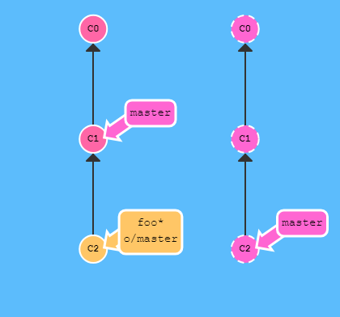

# 7. 시나리오 학습

***

# 좋은 커밋 메시지 작성하기

[좋은 git 커밋 메시지를 작성하기 위한 7가지 약속](https://item4.github.io/2016-11-01/How-to-Write-a-Git-Commit-Message/)

***

# 커밋을 골라서 적용하기

개발중에 종종 이런 상황이 생깁니다. 잘 띄지 않는 버그를 찾아서 해결하려고, 어떤 부분의 문제인지를 찾기 위해 디버그용 코드와 화면에 정보를 프린트하는 코드를 몇 줄 넣습니다. 디버깅용 코드나 프린트 명령은 bugFix 브랜치에 들어있습니다. 마침내 버그를 찾아서 고쳤고, 원래 작업하는 브랜치에 합치면 됩니다.

이제 bugFix 브랜치의 내용을 master에 합쳐 넣으려 하지만 한 가지 문제가 있습니다. 그냥 간단히 master 브랜치를 `최신 커밋으로 이동(Fast-Forward)`시킨다면 그 불필요한 디버그용 코드들도 함께 들어가 버린다는 점이 문제입니다.

여기에서 Git의 마법이 드러납니다. 이 문제를 해결하는 여러가지 방법이 있습니다만, 가장 간단한 두가지 방법은 아래와 같습니다:

### `$ git rebase -i`

대화형(-i 옵션) 리베이스(rebase)로는 어떤 커밋을 취하거나 버릴지를 선택할 수 있습니다. 또 커밋의 순서를 바꿀 수도 있습니다. 이 커맨드는 어떤 작업의 일부만을 골라내는 작업에 유용합니다.

### `$ git cherry-pick`

체리픽은 개별 커밋을 골라서 HEAD위에 떨어뜨릴 수 있습니다. 예를 들어 debug 커밋과 print 커밋은 선택하지 말고 bugFix 커밋만을 체리픽해서 master 브랜치에 떨구면 됩니다.

***

# 한참 전 커밋의 내용 바꾸기

이번에도 꽤 자주 발생하는 상황입니다. newImage와 caption 브랜치에 각각의 변경내역이 있고 서로 약간 관련이 있어서, 저장소에 차례로 쌓여있는 상황입니다.

때로는 한참 전 커밋의 내용을 살짝 바꿔야하는 골치아픈 상황에 빠지게 됩니다. 이 문제를 다음과 같이 풀어봅시다.

### `$ git rebase -i HEAD~4`
명령으로 우리가 바꿀 커밋을 가장 최근 순서로 바꾸어 놓습니다.

### `$ git commit -m "changed" --amend`
명령으로 커밋의 내용을 정정합니다. 정정할 커밋이 바로 직전에 있으면 --amend 옵션으로 간단히 수정할 수 있습니다.

### `$ git rebase -i HEAD~4`
명령으로 이 전의 커밋 순서대로 되돌려 놓습니다.

### `$ git branch -f master HEAD`
명령으로 master를 지금 트리가 변경된 부분으로 이동합니다.

충돌이 예상될 때는 체리픽으로 작업하는 것이 훨씬 좋습니다. 위 작업을 다시 수행하되 rebase -i를 쓰지 말고 체리픽으로 할 수 있는 방법을 살펴봅니다.

### `$ git checkout master`

### `$ git cherry-pick C2`

### `$ git commit -m "changed" --amend`

### `$ git cherry-pick C3`

***

# 이정표(태그) 확인

커밋 트리에서 태그가 훌륭한 "닻"역할을 하기 때문에, git에는 여러분이 가장 가까운 태그에 비해 상대적으로 어디에 위치해있는지 설명해주는 명령어가 있습니다. 이 명령어는 `git describe` 입니다.

`git describe` 명령은 커밋 히스토리에서 앞 뒤로 여러 커밋을 이동하고 나서 커밋 트리에서 방향감각을 다시 찾는데 도움을 줍니다. 이런 상황은 `git bisect`(문제가 되는 커밋을 찾는 명령어라고 간단히 생각하자)를 하고 나서라던가 휴가를 다녀온 동료의 컴퓨터에 앉는 경우가 있습니다.

`git describe` 는 다음의 형태를 가지고 있습니다:

`git describe <ref>`

`<ref>`에는 commit을 의미하는 그 어떤것(HEAD, 브랜치, 커밋해쉬값)이던 쓸 수 있습니다. 만약 ref를 특정 지어주지 않으면 git은 그냥 지금 `체크아웃된 곳(HEAD)`을 사용합니다.

명령어의 출력은 다음과 같은 형태로 나타납니다.

`<tag>_<numCommits>_g<hash>`

tag는 가장 가까운 부모 태그를 나타냅니다. numCommits은 그 태그가 몇 커밋 멀리있는지를 나타냅니다. `<hash>`는 묘사하고있는 커밋의 해시를 나타냅니다.

***

# origin/master가 원격 저장소보다 뒤처져 있을 때에 push 작업

여러분은 월요일에 저장소를 clone해서 부가기능을 만들기 시작했습니다. 금요일쯤 기능을 공개할 준비가 되었습니다. 그런데 동료들이 주중에 코딩을 잔뜩해서 여러분이 만든 기능은 프로젝트에 뒤떨어져서 무용지물이 되었습니다. 이 사람들이 그 커밋들을 공유하고있는 원격 저장소에도 공개했습니다, 이제 여러분의 작업은 이제 의미가 없는 구버전의 프로젝트를 기반으로한 작업이 되어버렸습니다.

이런 경우, 명령어 git push가 할 일이 애매해집니다. git push를 수행했을때, git은 원격 저장소를 여러분이 작업했던 월요일의 상태로 되돌려야 할까요? 아니면 새 코드를 건들지 않고 여러분의 코드만 추가해야 되나요? 아니면 여러분의 작업은 뒤 떨어졌기 때문에 완전히 무시해야되나요?

히스토리가 엇갈려서 상황이 애매모호하기 때문에 git은 여러분이 push하지 못하게 합니다. 사실 여러분이 작업을 공유하기전에 원격 저장소의 최신 상태를 합치도록 강제합니다.

그림과 같은 상태에서 다음 명령은 실행되지 않아서 아무것도 잃어나지 않습니다.

`git push`

여러분의 최근 커밋 C3가 원격저장소의 C1을 기반으로 하기 때문에 git push가 실패합니다. 원격 저장소는 C2까지 갱신된 상태기때문에 git은 여러분의 push를 거부하게됩니다.

그러면 이 상황을 어떻게 해결할까요? 쉽습니다, 여러분의 작업을 원격 브랜치의 최신상태를 기반으로 하게 만들면 됩니다.

이렇게 하기위한 방법이 여러가지가 있는데, 가장 간결한 방법은 리베이스를 통해 작업을 옮기는 방법입니다.

`git fetch && git rebase origin/master`

`git push`

git fetch로 원격 저장소의 변경정보를 가져오고, 새 변경들로 우리 작업을 리베이스 했습니다. 그런 다음 이제 git push하면 업로드가 됩니다! 다음 화면을 참고하여 작업결과를 확인하세요.

rebase 명령을 사용하지 않고 해결할 수 있는 다른 방법으로는 merge가 있습니다.

git merge가 여러분의 작업을 옮기지는 않지만 merge 커밋을 생성합니다. git에게 원격 저장소의 변경을 합쳤다고 알려주는 방법중에 하나입니다. 이제 원격 브랜치가 여러분 브랜치의 부모가 되었기때문입니다. 여러분의 커밋이 원격 브랜치의 모든 커밋을 반영했다는 뜻이죠.

`git fetch && git merge origin/master`

`git push`

위 명령을 줄여서 다음과 같이 사용할 수 있습니다. 결과는 같습니다.

`git pull`

`git push`

git fetch로 원격 저장소의 변경정보를 가져옵니다. 원격 저장소의 변경을 반영하기 위해서 새 작업을 우리 작업으로 병합했습니다. 이제 git push하면 업로드가 됩니다.

rebase 대신 merge 했을 때에 차이점을 그림으로 살펴보세요.

명령어를 좀더 적게써서 하는 방법은 없나요? 물론 있습니다. 여러분은 git pull이 fetch와 merge의 줄임 명령어라는 것은 이미 알고 있을 것입니다. 아주 간단하게 `git pull --rebase` 명령을 사용하면 fetch 후 merge 대신 rebase를 수행합니다.

`git fetch && git rebase origin/master`

`git push`

위 명령을 줄여서 다음과 같이 사용할 수 있습니다. 결과는 같습니다.

`git pull --rebase`

`git push`

***

# 팀 프로젝트 수행 시나리오

## 팀장 manager

### 1. 프로젝트 생성

  * Client : Angular Project
  콘솔에서 `ng new project`

  * Server : Spring Project
  STS에서 `spring starter project` 선택

### 2. 로컬 저장소 생성

`git init`

### 3. `.gitignore` 파일 생성

  * 빈 폴더 공유 시 `.gitkeep` 파일 생성

### 4. 커밋 대상 등록 &rArr; 초기 커밋

`git add .`

`git commit -m "커밋 메시지"`

### 5. 원격 저장소에 업로드

`git remote add origin [GitHub URL]`

`git push -u origin master`

### 6. Collaborators 등록

팀원 A, 팀원 B ...

### 7. 팀원들에게 공지

  * 팀 프로젝트 URL 통보
  * 작업 파일을 구분하면 충돌이 발생하지 않는다.
  * 작업 폴더 자체를 구분하면 더욱 더 충돌이 발생하지 않는다.

### 8. 팀 매니저도 개발에 참여

이후 내용은 팀원의 작업과 동일 함

## 팀원 A

### 1. 팀 프로젝트 다운로드

`git clone [GitHub URL]`

### 2. 코드 작성

### 3. 개발 된 코드 업로드

`git add .`

`git commit -m "커밋 메시지"`

`git push`

`git push` 거부 시 `git pull` 수행 후 다시 `git push`

## 팀원 B

팀원 A 작업과 동일 함

***

# 원격 추적

개발자들은 주로 큰 프로젝트를 개발할때 작업을 feature 브랜치(topic 브랜치)들에서 수행하고 작업이 끝나면 그 작업을 주 브랜치에 통합하여 반영합니다.

어떤 개발자들은 master 브랜치에 있을때만 push와 pull을 수행합니다. 이렇게하면 master는 원격 브랜치(origin/master)의 상태와 동일하게 최신의 상태로 유지될 수 있기 때문입니다.

이런 작업흐름은 다음 두가지 작업을 병행하게 됩니다.

* feature 브랜치의 작업을 master로 통합하는 작업
* 원격저장소에 push하고 pull하는 작업

pull 작업을 하는 도중, 커밋들은 origin/master에 내려받아 지고 그다음 master 브랜치로 merge됩니다. push 작업을 하는 도중, master 브랜치의 작업은 원격의 master브랜치로 push 됩니다. 로컬의 origin/master는 원격의 master브랜치와 동기화 됩니다. push의 목적지는 master와 origin/master의 연결에서 결정됩니다.

간단히 말해서, 이 master와 origin/master사이의 연결은 브랜치의 "원격 추적" 속성을 통해 간단하게 설명됩니다. master브랜치는 origin/master브랜치를 추적하도록 설정되어 있습니다. 이것은 master가 merge와 push할 내재된 목적지가 생겼다는 뜻 입니다.

여러분은 어떻게 이 속성을 지정해주는 그 어떤 명령어 없이 master 브랜치에 설정되있는지 궁금할것 입니다. 사실, 여러분이 git으로 저장소를 clone할 때 이 속성이 여러분을 위해 자동으로 설정 됩니다.

clone을 진행하면서 git은 원격 저장소에있는 모든 브랜치에 대해 로컬에 원격 브랜치를 생성합니다. origin/master 같은것들 말이죠. 그 후 원격 저장소에서 현재 active한 브랜치를 추적하는 로컬 브랜치를 생성합니다, 대부분의 경우 master가 됩니다.

git clone이 완료되면, 여러분은 오로지 하나의 로컬 브랜치를 가지게 됩니다. 물론 원격 저장소에 있는 여러 다른 브랜치도 여전히 확인할 수 있습니다.

여러분이 clone을 수행할 때 아래의 명령어를 볼 수도 있는 이유입니다:

`local branch "master" set to track remote branch "origin/master"`

개발자가 직접 지정할 수도 있나요?

당연하죠! 여러분은 임의의 브랜치가 origin/master를 추적하게 만들 수 있습니다. 이렇게 하면 이 브랜치 또한 내재된 push, merge 목적지를 master로 할 것입니다. 여러분은 이제 totallyNotMaster라는 브랜치에서 git push를 수행해서 원격 저장소의 브랜치 master로 작업을 push할 수 있습니다.

이 속성을 설정하는데에는 두가지 방법이 있습니다.

### 방법 #1

첫 번째는 지정한 원격 브랜치를 참조해서 새로운 브랜치를 생성하여 checkout 하는 방법 입니다.

`git checkout -b totallyNotMaster origin/master`

위 명령을 실행하면 totallyNotMaster라는 이름의 새 브랜치를 생성하고 origin/master를 추적하게 설정합니다. 브랜치의 이름을 전혀 다른것으로 지었는데도 불구하고 우리 작업이 원격 저장소의 master와 pull/push 될 수 있습니다.

### 방법 #2

브랜치에 원격 추적 설정을 하는 또 다른 방법으로는 간단하게 git branch -u 옵션을 사용하는 방법이 있습니다.

`git branch -u origin/master foo`

foo 브랜치가 이미 만들어진 상태에서 수행합니다. 위 명령은 foo 브랜치가 origin/master를 추적하도록 설정합니다. 만약 foo가 현재 작업하고 있는 브랜치라면 foo를 생략해도 됩니다.

`git branch -u origin/master foo`
`git commit`
`git push`

`git checkout master`

`git branch side`

`git branch -u origin/master side`

`git checkout side`

`git commit -m "updated"`

`git pull --rebase`

`git push`

위 명령 대신 아래처럼 사용할 수도 있습니다.

`git checkout master`

`git checkout -b side origin/master`

`git commit -m "updated"`

`git pull --rebase`

`git push`

***

# 따라해 보기

명령을 하나씩 따라하면서 그 의미를 추론해 보세요.

### 새 프로젝트 생성
mkdir git_lesson\
cd git_lesson

### 로컬 깃 저장소 생성
git init\
git status

### 새 파일 생성, 깃 추적 확인
echo 'Hello World' > hello.txt\
git status

### 스테이지에 등록
git add hello.txt\
git status

### 커밋하기
git commit -m 'first commit'\
git status

### 커밋 히스토리 조회
git log

### 브랜치 목록 조회
git branch

### 새 브랜치 생성
git branch hotfix1\
git branch

### 브랜치 이동
git checkout hotfix1\
git branch

### 파일목록 조회
ls -al

### 파일에 코드 추가, 상태 확인
echo 'Good Night' > hello.txt\
type hello.txt\
git status

### 워킹 디렉토리 파일 변경내용 되돌리기
git checkout HEAD -- hello.txt\
type hello.txt\
git status

-- 옵션은 앞 부분에 옵션과 패스 문자열을 구분하는 용도로 사용합니다. 
`git checkout hello` 에서 hello는 브랜치임을 나타냅니다.
`git checkout -- hello` 에서 hello는 파일 패스를 가리킵니다.

### 파일에 코드 추가, 상태 확인
echo 'Good Night' > hello.txt\
type hello.txt\
git status

### 스테이징 및 커밋하기
git commit -am 'changed hello.txt'\
git status\
git log

### 브랜치 전환
git branch\
git checkout master\
git branch

### 브랜치 합병하기
git merge hotfix1\
type hello.txt\
git status

### 코드 변경하기
echo 'added on master' >> hello.txt\
git status

### 커밋하기
git commit -am 'updated hello.txt'\
git status\
git log

### 브랜치 전환하기
git branch\
git checkout hotfix1\
git branch\
type hello.txt

### 합병하기(합병 커밋 남기기)
git merge master --no-ff\
git status\
type hello.txt

합병 시 merge commit 기록을 남기기 위해서 `--no-ff` 옵션을 사용한다.

### 합병 커밋 취소하기
git reset --merge ORIG_HEAD\
git log\
git status\
type hello.txt

`ORIG_HEAD`는 합병 커밋이 아닌 이전에 수행된 오리지널 커밋을 가리킨다. 실수로 지운 커밋을 되돌릴 때 사용한다.
